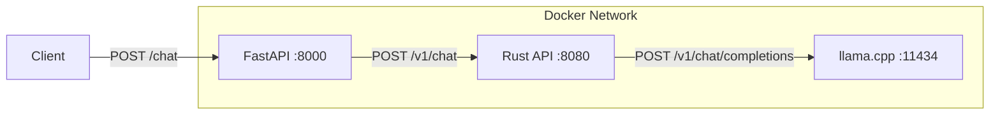

# llama.cpp FastAPI Rust Chat

A multi-tiered chat application integrating **FastAPI**, **Rust (Actix-Web)**, and **llama.cpp**. Optimized for high-performance LLM inference on **ARM64 (Raspberry Pi)** and other Linux architectures using native compilation.

## Project Architecture

This project uses a microservices architecture to ensure security, request serialization, and efficient inference:

1.  **FastAPI (Python)**: Acts as the public-facing API gateway. It handles CORS, input validation, and multi-layer content filtering (Profanity & LLM-Guard).
2.  **Rust API (Actix-Web)**: A high-performance middleware that manages request queuing via a `Semaphore(1)`—ensuring the LLM isn't overwhelmed—and injects system-level instructions.
3.  **llama.cpp**: The inference engine, built natively from source for maximum hardware optimization.



## Prerequisites

- [Docker](https://www.docker.com/)
- [Docker Compose](https://docs.docker.com/compose/)

## Getting Started

1.  **Clone the repository**:
    ```bash
    git clone <repository-url>
    cd llamacpp-fastAPI-rust-chat
    ```

2.  **Start the services**:
    ```bash
    docker compose up --build
    ```
    *Note: The first run will take several minutes as it compiles `llama.cpp` natively for your CPU and downloads the Llama 3.2 1B GGUF model (~700MB).*

3.  **Access the API**:
    The main endpoint is exposed via FastAPI on port `8000`.

4.  **Start the Client (Optional)**:
    Once the backend services are running, you can start the React chat UI:
    ```bash
    cd client
    npm install
    npm run dev
    ```
    The client will be available at `http://localhost:8080` by default.
    
    **Note**: Create a `client/.env` file with your server details:
    ```bash
    VITE_LLM_SERVER_IP="localhost"
    VITE_LLM_SERVER_PORT="8000"
    VITE_LOADING_MESSAGE="Thinking"
    ```

## API Usage

### Chat Endpoint
**URL**: `http://localhost:8000/chat`
**Method**: `POST`

**Request Body**:
```json
{
  "prompt": "Explain the concept of entropy.",
  "refusal_message": "Optional custom block message",
  "messages": []
}
```

## Content Moderation & Refusal Logic

This project implements a multi-layered safety and moderation system. Refusals happen at two distinct stages:

### 1. Hard Refusal (Pre-Inference)
Handled by **FastAPI**, if a prompt is blocked here, it **never reaches the LLM**. The API returns a `200 OK` with a JSON response containing a "refusal message".

- **Default Message**: "The prompt contains content that is not allowed. I cannot assist with topics related to restricted content."
- **Customization**: The client can send a `refusal_message` in the request body to override this default.
- **Triggers**:
    - **Keyword Filter**: Checks against a list of profanity and blocked words.
    - **LLM-Guard**: Uses specialized mini-models (DeBERTa) to detect Prompt Injection and Toxicity.

### 2. Soft Refusal (In-Inference)
Handled by the **LLM** itself via instructions injected by the **Rust Middleware**.

- **Instruction Source**: The `server/RUST_TAURI/llammacpp_server/topics.txt` file.
- **Mechanism**: The Rust service reads `topics.txt` and wraps it into a **System Prompt**. It instructs the AI: *"You stay strictly on these topics: [topics.txt contents]. If a user asks about other topics, you MUST state that you do not have access."*
- **Effect**: The AI will generate a polite refusal message in its own voice if the user tries to talk about off-limit subjects.

## Optimization Notes (Raspberry Pi 5)
- **Native Build**: The `llama-server` is compiled from source inside the container to use ARM-specific instructions (NEON/FMA).
- **RAM Management**: Context is limited to `2048` tokens (`-c 2048`) and the prompt cache is disabled (`--cache-ram 0`) to prevent OOM (Out of Memory) crashes while running alongside Python security models.

## License
[MIT](LICENSE)
