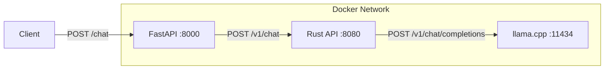

# llama.cpp FastAPI Rust Chat

A multi-tiered chat application integrating **FastAPI**, **Rust (Actix-Web)**, and **llama.cpp**. Optimized for high-performance LLM inference on **ARM64 (Raspberry Pi)** and other Linux architectures using native compilation.

## Project Architecture

This project uses a microservices architecture to ensure security, request serialization, and efficient inference:

1.  **FastAPI (Python)**: Acts as the public-facing API gateway. It handles CORS, input validation, and multi-layer content filtering (Profanity & LLM-Guard).
2.  **Rust API (Actix-Web)**: A high-performance middleware that manages request queuing via a `Semaphore(1)`—ensuring the LLM isn't overwhelmed—and injects system-level instructions.
3.  **llama.cpp**: The inference engine, built natively from source for maximum hardware optimization.



## Prerequisites

- [Docker](https://www.docker.com/)
- [Docker Compose](https://docs.docker.com/compose/)

## Getting Started

1.  **Clone the repository**:
    ```bash
    git clone <repository-url>
    cd ollama-fastAPI-rust-chat
    ```

2.  **Start the services**:
    ```bash
    docker compose up --build
    ```
    *Note: The first run will take several minutes as it compiles `llama.cpp` natively for your CPU and downloads the Llama 3.2 1B GGUF model (~700MB).*

3.  **Access the API**:
    The main endpoint is exposed via FastAPI on port `8000`.

## API Usage

### Chat Endpoint
**URL**: `http://localhost:8000/chat`
**Method**: `POST`

**Request Body**:
```json
{
  "prompt": "Explain the concept of entropy.",
  "refusal_message": "Optional custom block message",
  "messages": []
}
```

## Component Details

### 1. FastAPI Service (`server/FastAPI`)
- **Port**: 8000
- **Responsibility**: Security and filtering.
- **Safety**: Uses a fast keyword filter followed by `llm-guard` for deep prompt scan (Injection/Toxicity).

### 2. Rust Service (`server/RUST_TAURI`)
- **Port**: 8080
- **Feature**: Strictly serializes requests to protect CPU/RAM on hardware like the Raspberry Pi.
- **Health Check**: Automatically waits for the LLM model to finish loading before opening the API.

### 3. llama.cpp Service
- **Port**: 11434
- **Model**: `Llama-3.2-1B-Instruct`
- **Optimization**: Compiled natively with `GGML_NATIVE=ON`. Memory usage is capped (`-c 2048`) to ensure stability on devices with 4GB-8GB RAM.
- **Build**: Built from source via a multi-stage Dockerfile located in `server/llama-cpp/`.

## License
[MIT](LICENSE)
